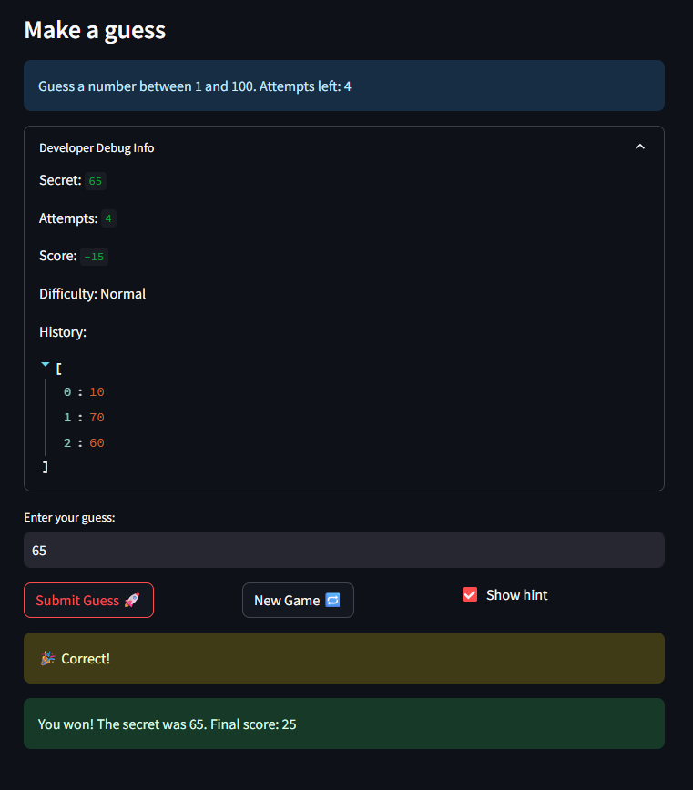

# 🎮 Game Glitch Investigator: The Impossible Guesser

## 🚨 The Situation

You asked an AI to build a simple "Number Guessing Game" using Streamlit.
It wrote the code, ran away, and now the game is unplayable. 

- You can't win.
- The hints lie to you.
- The secret number seems to have commitment issues.

## 🛠️ Setup

1. Install dependencies: `pip install -r requirements.txt`
2. Run the broken app: `python -m streamlit run app.py`

## 🕵️‍♂️ Your Mission

1. **Play the game.** Open the "Developer Debug Info" tab in the app to see the secret number. Try to win.
2. **Find the State Bug.** Why does the secret number change every time you click "Submit"? Ask ChatGPT: *"How do I keep a variable from resetting in Streamlit when I click a button?"*
3. **Fix the Logic.** The hints ("Higher/Lower") are wrong. Fix them.
4. **Refactor & Test.** - Move the logic into `logic_utils.py`.
   - Run `pytest` in your terminal.
   - Keep fixing until all tests pass!

## 📝 Document Your Experience

- [ ] Describe the game's purpose.
   + The purpose of the game is to let the user guess a randomly generated secret number based on a selected difficulty level. The player enters guesses, receives hints about whether the guess is too high or too low
- [ ] Detail which bugs you found.
   + One major bug was that the hints were reversed — when a guess was too high, the game would say it was too low, and vice versa. Another issue was that the history of guesses was not displaying correctly, so players couldn’t clearly see their previous attempts.
- [ ] Explain what fixes you applied.
   + To fix the reversed hints, I corrected the comparison logic so that the messages matched the actual relationship between the guess and the secret number. I repaired the guess history by ensuring each guess was properly appended to session state and displayed in order.
## 📸 Demo

- [ ] 

## 🚀 Stretch Features

- [ ] [If you choose to complete Challenge 4, insert a screenshot of your Enhanced Game UI here]
